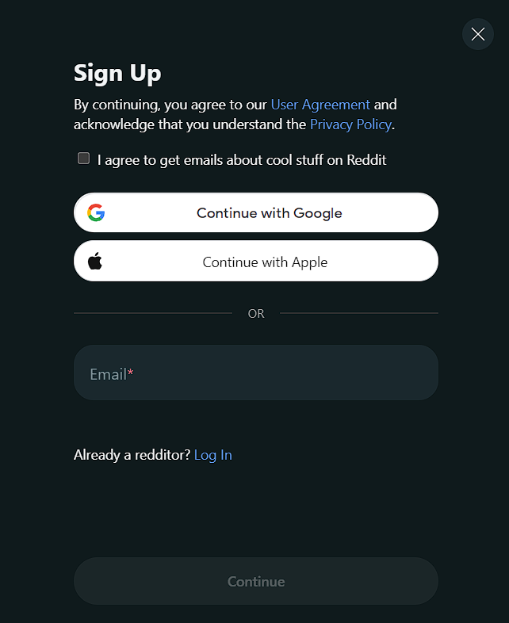
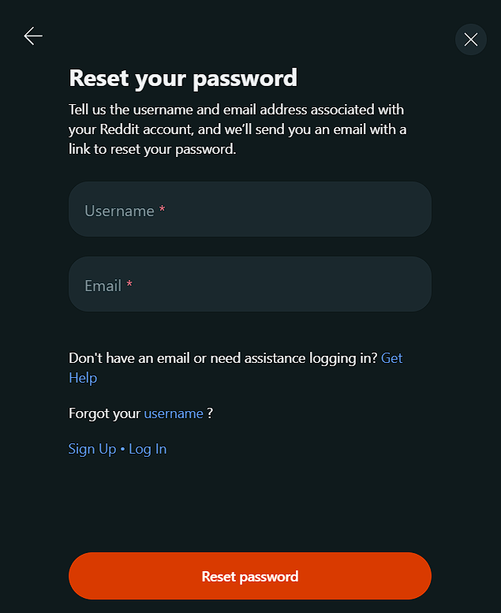
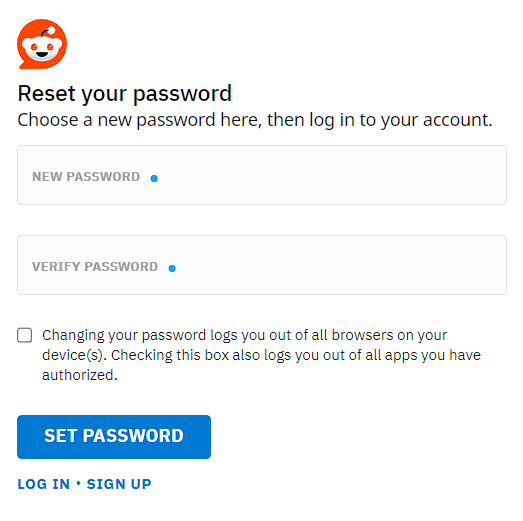
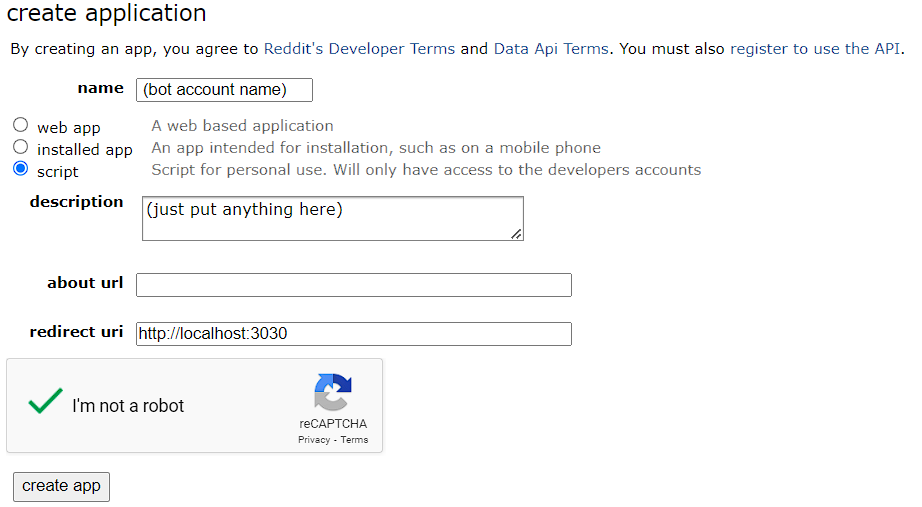
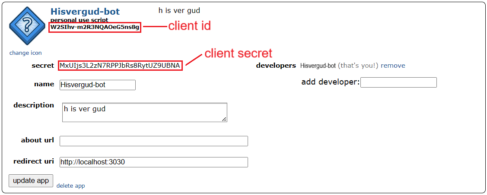
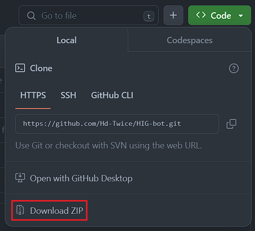

# how to create a letter bot
this is a guide on how to create a lettor bot in PRAW (Python Reddit API Wrapper)
## setting up the bot
### 1. create a new reddit account
go to reddit.com (sign out if your already logged in) and create a new account for your bot

#### signing up with email
this is the easiest way to create a bot account, no additional steps required

#### signing up with google/apple account
this requires a few more steps to set up
1. sign out of your account
2. when signing back in, click `forgot password`

3. enter the username of your new bot account, and the email with your google account/apple id
4. check your email, they should have sent you an email to reset your password
5. go on the link to reset your password, and enter the password you want for this bot account

6. go to reddit.com and sign back into your account

### 2. add a bot to your bot account
1. go to https://old.reddit.com/prefs/apps/ and click `are you a developer? create an app...`
2. fill in the details with this guide:

3. click `create app` and save these:

## the code
1. download this repo as a zip

2. extract the zip and move the `Template` folder out of the folder
3. rename the `Template` folder to the name of your bot
4. fill in `your_bot.py` with your details

# links
* [PRAW docs](https://praw.readthedocs.io)
* [r/theletterbots](https://www.reddit.com/r/theletterbots)
* [HIG-bot repo](https://github.com/Hd-Twice/HIG-bot)
* [h-bot10000 repo](https://github.com/hcorporation/h-bot10000)

[join the H'd Twice discord server for more help](https://discord.com/invite/ZrEwrpWJWD)